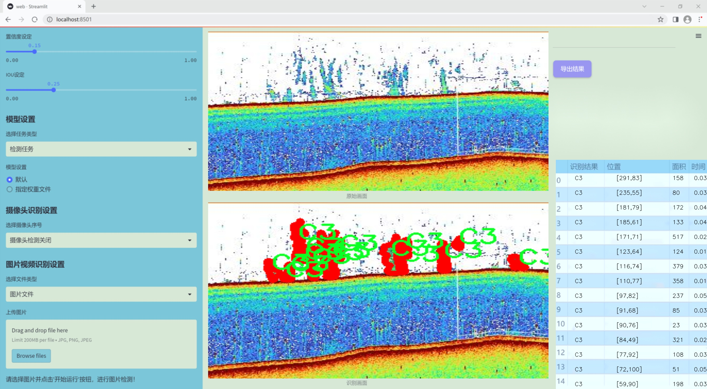

### 1.背景意义

研究背景与意义

随着全球海洋资源的日益枯竭和环境问题的加剧，海洋生态系统的保护与管理变得愈发重要。海洋物体实例分割技术作为计算机视觉领域的一项重要应用，能够有效地识别和分割海洋中的各种物体，为海洋生物监测、环境保护和资源管理提供了强有力的技术支持。近年来，深度学习技术的快速发展，尤其是目标检测和实例分割算法的进步，使得海洋物体的自动识别和分析成为可能。YOLO（You Only Look Once）系列模型因其高效性和准确性，已成为目标检测领域的主流选择。

本研究旨在基于改进的YOLOv11模型，构建一个高效的海洋物体实例分割系统。通过对海洋图像数据集的深入分析与处理，我们将重点关注四类海洋物体的识别与分割：C3、C4、C5和maybegas。这些类别的选择不仅涵盖了海洋生态系统中的重要组成部分，还能够为海洋资源的可持续利用提供数据支持。数据集包含1700幅图像，涵盖了多种海洋环境下的物体实例，具备较高的代表性和多样性。

在技术层面，改进YOLOv11模型将通过引入更为先进的特征提取网络和优化的损失函数，提升模型在复杂海洋环境中的分割精度和鲁棒性。同时，实例分割的实现将为后续的海洋物体追踪、行为分析等研究奠定基础。通过本项目的实施，我们期望不仅能推动海洋物体识别技术的发展，还能为海洋生态保护提供科学依据，促进海洋可持续发展目标的实现。

### 2.视频效果

[2.1 视频效果](https://www.bilibili.com/video/BV1spkKY6EDN/)

### 3.图片效果





##### [项目涉及的源码数据来源链接](https://kdocs.cn/l/cszuIiCKVNis)**

注意：本项目提供训练的数据集和训练教程,由于版本持续更新,暂不提供权重文件（best.pt）,请按照6.训练教程进行训练后实现上图演示的效果。

### 4.数据集信息

##### 4.1 本项目数据集类别数＆类别名

nc: 4
names: ['C3', 'C4', 'C5', 'maybegas']


该项目为【图像分割】数据集，请在【训练教程和Web端加载模型教程（第三步）】这一步的时候按照【图像分割】部分的教程来训练

##### 4.2 本项目数据集信息介绍

本项目数据集信息介绍

本项目旨在开发和改进YOLOv11的海洋物体实例分割系统，为此我们构建了一个高质量的数据集，名为“Pixels 2.0”。该数据集专注于海洋环境中的特定物体识别与分割，涵盖了四个主要类别：C3、C4、C5和maybegas。这些类别代表了在海洋生态系统中具有重要意义的物体，分别对应于不同的海洋生物或物体特征。通过对这些类别的细致标注，我们的目标是提高YOLOv11在复杂海洋环境中的识别精度和分割效果。

数据集的构建过程涉及多种数据采集技术，包括水下摄影、遥感技术以及人工智能辅助的图像处理。每个类别的样本均经过严格筛选，确保其在多种环境条件下的代表性和多样性。这种多样性不仅有助于模型的泛化能力，还能提升其在实际应用中的表现。此外，数据集中包含了丰富的背景信息，以模拟真实海洋环境中的复杂性，确保模型在不同光照、深度和水流条件下的鲁棒性。

为了便于后续的训练和测试，我们对数据集进行了详细的标注和分类，确保每个样本都清晰地标识出其所属类别。这样的标注不仅为模型的训练提供了必要的监督信号，也为后续的评估和验证提供了可靠的基础。通过“Pixels 2.0”数据集的使用，我们期望能够推动海洋物体实例分割技术的发展，为海洋生态保护和资源管理提供更为精确的工具和方法。


### 5.全套项目环境部署视频教程（零基础手把手教学）

[5.1 所需软件PyCharm和Anaconda安装教程（第一步）](https://www.bilibili.com/video/BV1BoC1YCEKi/?spm_id_from=333.999.0.0&vd_source=bc9aec86d164b67a7004b996143742dc)


[5.2 安装Python虚拟环境创建和依赖库安装视频教程（第二步）](https://www.bilibili.com/video/BV1ZoC1YCEBw?spm_id_from=333.788.videopod.sections&vd_source=bc9aec86d164b67a7004b996143742dc)

### 6.改进YOLOv11训练教程和Web_UI前端加载模型教程（零基础手把手教学）

[6.1 改进YOLOv11训练教程和Web_UI前端加载模型教程（第三步）](https://www.bilibili.com/video/BV1BoC1YCEhR?spm_id_from=333.788.videopod.sections&vd_source=bc9aec86d164b67a7004b996143742dc)


按照上面的训练视频教程链接加载项目提供的数据集，运行train.py即可开始训练



     Epoch   gpu_mem       box       obj       cls    labels  img_size
     1/200     20.8G   0.01576   0.01955  0.007536        22      1280: 100%|██████████| 849/849 [14:42<00:00,  1.04s/it]
               Class     Images     Labels          P          R     mAP@.5 mAP@.5:.95: 100%|██████████| 213/213 [01:14<00:00,  2.87it/s]
                 all       3395      17314      0.994      0.957      0.0957      0.0843

     Epoch   gpu_mem       box       obj       cls    labels  img_size
     2/200     20.8G   0.01578   0.01923  0.007006        22      1280: 100%|██████████| 849/849 [14:44<00:00,  1.04s/it]
               Class     Images     Labels          P          R     mAP@.5 mAP@.5:.95: 100%|██████████| 213/213 [01:12<00:00,  2.95it/s]
                 all       3395      17314      0.996      0.956      0.0957      0.0845

     Epoch   gpu_mem       box       obj       cls    labels  img_size
     3/200     20.8G   0.01561    0.0191  0.006895        27      1280: 100%|██████████| 849/849 [10:56<00:00,  1.29it/s]
               Class     Images     Labels          P          R     mAP@.5 mAP@.5:.95: 100%|███████   | 187/213 [00:52<00:00,  4.04it/s]
                 all       3395      17314      0.996      0.957      0.0957      0.0845


###### [项目数据集下载链接](https://kdocs.cn/l/cszuIiCKVNis)

### 7.原始YOLOv11算法讲解

##### YOLO11简介

> YOLO11源码地址：https://github.com/ultralytics/ultralytics

Ultralytics
YOLO11是一款尖端的、最先进的模型，它在之前YOLO版本成功的基础上进行了构建，并引入了新功能和改进，以进一步提升性能和灵活性。YOLO11设计快速、准确且易于使用，使其成为各种物体检测和跟踪、实例分割、图像分类以及姿态估计任务的绝佳选择。  


**YOLO11创新点如下:**

YOLO 11主要改进包括：  
`增强的特征提取`：YOLO 11采用了改进的骨干和颈部架构，增强了特征提取功能，以实现更精确的目标检测。  
`优化的效率和速度`：优化的架构设计和优化的训练管道提供更快的处理速度，同时保持准确性和性能之间的平衡。  
`更高的精度，更少的参数`：YOLO11m在COCO数据集上实现了更高的平均精度（mAP），参数比YOLOv8m少22%，使其在不影响精度的情况下提高了计算效率。  
`跨环境的适应性`：YOLO 11可以部署在各种环境中，包括边缘设备、云平台和支持NVIDIA GPU的系统。  
`广泛的支持任务`：YOLO 11支持各种计算机视觉任务，如对象检测、实例分割、图像分类、姿态估计和面向对象检测（OBB）。

**YOLO11不同模型尺寸信息：**

YOLO11 提供5种不同的型号规模模型，以满足不同的应用需求：

Model| size (pixels)| mAPval 50-95| Speed CPU ONNX (ms)| Speed T4 TensorRT10
(ms)| params (M)| FLOPs (B)  
---|---|---|---|---|---|---  
YOLO11n| 640| 39.5| 56.1 ± 0.8| 1.5 ± 0.0| 2.6| 6.5  
YOLO11s| 640| 47.0| 90.0 ± 1.2| 2.5 ± 0.0| 9.4| 21.5  
YOLO11m| 640| 51.5| 183.2 ± 2.0| 4.7 ± 0.1| 20.1| 68.0  
YOLO11l| 640| 53.4| 238.6 ± 1.4| 6.2 ± 0.1| 25.3| 86.9  
YOLO11x| 640| 54.7| 462.8 ± 6.7| 11.3 ± 0.2| 56.9| 194.9  
  
**模型常用训练超参数参数说明：**  
`YOLOv11
模型的训练设置包括训练过程中使用的各种超参数和配置`。这些设置会影响模型的性能、速度和准确性。关键的训练设置包括批量大小、学习率、动量和权重衰减。此外，优化器、损失函数和训练数据集组成的选择也会影响训练过程。对这些设置进行仔细的调整和实验对于优化性能至关重要。  
**以下是一些常用的模型训练参数和说明：**

参数名| 默认值| 说明  
---|---|---  
`model`| `None`| 指定用于训练的模型文件。接受指向 `.pt` 预训练模型或 `.yaml`
配置文件。对于定义模型结构或初始化权重至关重要。  
`data`| `None`| 数据集配置文件的路径（例如
`coco8.yaml`).该文件包含特定于数据集的参数，包括训练数据和验证数据的路径、类名和类数。  
`epochs`| `100`| 训练总轮数。每个epoch代表对整个数据集进行一次完整的训练。调整该值会影响训练时间和模型性能。  
`patience`| `100`| 在验证指标没有改善的情况下，提前停止训练所需的epoch数。当性能趋于平稳时停止训练，有助于防止过度拟合。  
`batch`| `16`| 批量大小，有三种模式:设置为整数(例如，’ Batch =16 ‘)， 60% GPU内存利用率的自动模式(’ Batch
=-1 ‘)，或指定利用率分数的自动模式(’ Batch =0.70 ')。  
`imgsz`| `640`| 用于训练的目标图像尺寸。所有图像在输入模型前都会被调整到这一尺寸。影响模型精度和计算复杂度。  
`device`| `None`| 指定用于训练的计算设备：单个 GPU (`device=0`）、多个 GPU (`device=0,1`)、CPU
(`device=cpu`)，或苹果芯片的 MPS (`device=mps`).  
`workers`| `8`| 加载数据的工作线程数（每 `RANK` 多 GPU 训练）。影响数据预处理和输入模型的速度，尤其适用于多 GPU 设置。  
`name`| `None`| 训练运行的名称。用于在项目文件夹内创建一个子目录，用于存储训练日志和输出结果。  
`pretrained`| `True`| 决定是否从预处理模型开始训练。可以是布尔值，也可以是加载权重的特定模型的字符串路径。提高训练效率和模型性能。  
`optimizer`| `'auto'`| 为训练模型选择优化器。选项包括 `SGD`, `Adam`, `AdamW`, `NAdam`,
`RAdam`, `RMSProp` 等，或 `auto` 用于根据模型配置进行自动选择。影响收敛速度和稳定性  
`lr0`| `0.01`| 初始学习率（即 `SGD=1E-2`, `Adam=1E-3`) .调整这个值对优化过程至关重要，会影响模型权重的更新速度。  
`lrf`| `0.01`| 最终学习率占初始学习率的百分比 = (`lr0 * lrf`)，与调度程序结合使用，随着时间的推移调整学习率。  


**各损失函数作用说明：**  
`定位损失box_loss`：预测框与标定框之间的误差（GIoU），越小定位得越准；  
`分类损失cls_loss`：计算锚框与对应的标定分类是否正确，越小分类得越准；  
`动态特征损失（dfl_loss）`：DFLLoss是一种用于回归预测框与目标框之间距离的损失函数。在计算损失时，目标框需要缩放到特征图尺度，即除以相应的stride，并与预测的边界框计算Ciou
Loss，同时与预测的anchors中心点到各边的距离计算回归DFLLoss。  


### 8.200+种全套改进YOLOV11创新点原理讲解

#### 8.1 200+种全套改进YOLOV11创新点原理讲解大全

由于篇幅限制，每个创新点的具体原理讲解就不全部展开，具体见下列网址中的改进模块对应项目的技术原理博客网址【Blog】（创新点均为模块化搭建，原理适配YOLOv5~YOLOv11等各种版本）

[改进模块技术原理博客【Blog】网址链接](https://gitee.com/qunmasj/good)


#### 8.2 精选部分改进YOLOV11创新点原理讲解

###### 这里节选部分改进创新点展开原理讲解(完整的改进原理见上图和[改进模块技术原理博客链接](https://gitee.com/qunmasj/good)【如果此小节的图加载失败可以通过CSDN或者Github搜索该博客的标题访问原始博客，原始博客图片显示正常】
### 深度学习基础
卷积神经网络通过使用具有共享参数的卷积运算显著降低了模型的计算开销和复杂性。在LeNet、AlexNet和VGG等经典网络的驱动下，卷积神经网络现在已经建立了一个完整的系统，并在深度学习领域形成了先进的卷积神经网络模型。

感受野注意力卷积RFCBAMConv的作者在仔细研究了卷积运算之后获得了灵感。对于分类、目标检测和语义分割任务，一方面，图像中不同位置的对象的形状、大小、颜色和分布是可变的。在卷积操作期间，卷积核在每个感受野中使用相同的参数来提取信息，而不考虑来自不同位置的差分信息。这限制了网络的性能，这已经在最近的许多工作中得到了证实。

另一方面，卷积运算没有考虑每个特征的重要性，这进一步影响了提取特征的有效性，并最终限制了模型的性能。此外，注意力机制允许模型专注于重要特征，这可以增强特征提取的优势和卷积神经网络捕获详细特征信息的能力。因此，注意力机制在深度学习中得到了广泛的应用，并成功地应用于各个领域。

通过研究卷积运算的内在缺陷和注意力机制的特点，作者认为现有的空间注意力机制从本质上解决了卷积运算的参数共享问题，但仍局限于对空间特征的认知。对于较大的卷积核，现有的空间注意力机制并没有完全解决共享参数的问题。此外，他们无法强调感受野中每个特征的重要性，例如现有的卷积块注意力模块（CBAM）和 Coordinate注意力（CA）。

因此，[参考该博客提出了一种新的感受野注意力机制（RFA）](https://qunmasj.com)，它完全解决了卷积核共享参数的问题，并充分考虑了感受野中每个特征的重要性。通过RFA设计的卷积运算（RFAConv）是一种新的卷积运算，可以取代现有神经网络中的标准卷积运算。RFAConv通过添加一些参数和计算开销来提高网络性能。

大量关于Imagnet-1k、MS COCO和VOC的实验已经证明了RFAConv的有效性。作为一种由注意力构建的新型卷积运算，它超过了由CAM、CBAM和CA构建的卷积运算（CAMConv、CBAMConv、CAConv）以及标准卷积运算。

此外，为了解决现有方法提取感受野特征速度慢的问题，提出了一种轻量级操作。在构建RFAConv的过程中，再次设计了CA和CBAM的升级版本，并进行了相关实验。作者认为当前的空间注意力机制应该将注意力放在感受野空间特征上，以促进当前空间注意力机制的发展，并再次增强卷积神经网络架构的优势。


### 卷积神经网络架构
出色的神经网络架构可以提高不同任务的性能。卷积运算作为卷积神经网络的一种基本运算，推动了人工智能的发展，并为车辆检测、无人机图像、医学等先进的网络模型做出了贡献。He等人认为随着网络深度的增加，该模型将变得难以训练并产生退化现象，因此他们提出了残差连接来创新卷积神经网络架构的设计。Huang等人通过重用特征来解决网络梯度消失问题，增强了特征信息，他们再次创新了卷积神经网络架构。

通过对卷积运算的详细研究，Dai等人认为，具有固定采样位置的卷积运算在一定程度上限制了网络的性能，因此提出了Deformable Conv，通过学习偏移来改变卷积核的采样位置。在Deformable Conv的基础上，再次提出了Deformable Conv V2和Deformable Conv V3，以提高卷积网络的性能。

Zhang等人注意到，组卷积可以减少模型的参数数量和计算开销。然而，少于组内信息的交互将影响最终的网络性能。1×1的卷积可以与信息相互作用。然而，这将带来更多的参数和计算开销，因此他们提出了无参数的“通道Shuffle”操作来与组之间的信息交互。

Ma等人通过实验得出结论，对于参数较少的模型，推理速度不一定更快，对于计算量较小的模型，推理也不一定更快。经过仔细研究提出了Shufflenet V2。

YOLO将输入图像划分为网格，以预测对象的位置和类别。经过不断的研究，已经提出了8个版本的基于YOLO的目标检测器，如YOLOv11、YOLOv11、YOLOv11等。上述卷积神经网络架构已经取得了巨大的成功。然而，它们并没有解决提取特征过程中的参数共享问题。本文的工作从注意力机制开始，从一个新的角度解决卷积参数共享问题。

### 注意力机制
注意力机制被用作一种提高网络模型性能的技术，使其能够专注于关键特性。注意力机制理论已经在深度学习中建立了一个完整而成熟的体系。Hu等人提出了一种Squeeze-and-Excitation（SE）块，通过压缩特征来聚合全局通道信息，从而获得与每个通道对应的权重。Wang等人认为，当SE与信息交互时，单个通道和权重之间的对应关系是间接的，因此设计了高效通道注Efficient Channel Attention力（ECA），并用自适应kernel大小的一维卷积取代了SE中的全连接（FC）层。Woo等人提出了卷积块注意力模块（CBAM），它结合了通道注意力和空间注意力。作为一个即插即用模块，它可以嵌入卷积神经网络中，以提高网络性能。

尽管SE和CBAM已经提高了网络的性能。Hou等人仍然发现压缩特征在SE和CBAM中丢失了太多信息。因此，他们提出了轻量级Coordinate注意力（CA）来解决SE和CBAM中的问题。Fu等人计了一个空间注意力模块和通道注意力模块，用于扩展全卷积网络（FCN），分别对空间维度和通道维度的语义相关性进行建模。Zhang等人在通道上生成不同尺度的特征图，以建立更有效的通道注意力机制。

本文从一个新的角度解决了标准卷积运算的参数共享问题。这就是将注意力机制结合起来构造卷积运算。尽管目前的注意力机制已经获得了良好的性能，但它们仍然没有关注感受野的空间特征。因此，设计了具有非共享参数的RFA卷积运算，以提高网络的性能。


#### 回顾标准卷积
以标准卷积运算为基础构建卷积神经网络，通过共享参数的滑动窗口提取特征信息，解决了全连接层构建的神经网络的固有问题（即参数数量大、计算开销高）。

设表示输入特征图，其中、和分别表示特征图的通道数、高度和宽度。为了能够清楚地展示卷积核提取特征信息的过程，以为例。提取每个感受野slider的特征信息的卷积运算可以表示如下：


这里，表示在每次卷积slider操作之后获得的值，表示在每个slider内的相应位置处的像素值。表示卷积核，表示卷积核中的参数数量，表示感受野slider的总数。

可以看出，每个slider内相同位置的特征共享相同的参数。因此，标准的卷积运算无法感知不同位置带来的差异信息，这在一定程度上限制了卷积神经网络的性能。

#### 回顾空间注意力
目前，空间注意力机制使用通过学习获得的注意力图来突出每个特征的重要性。与上一节类似，以为例。突出关键特征的空间注意力机制可以简单地表达如下：


这里，表示在加权运算之后获得的值。和分别表示输入特征图和学习注意力图在不同位置的值，是输入特征图的高度和宽度的乘积，表示像素值的总数。一般来说，整个过程可以简单地表示在图1中。


#### 空间注意力与标准卷积
众所周知，将注意力机制引入卷积神经网络可以提高网络的性能。通过标准的卷积运算和对现有空间注意力机制的仔细分析。作者认为空间注意力机制本质上解决了卷积神经网络的固有缺点，即共享参数的问题。

目前，该模型最常见的卷积核大小为1×1和3×3。引入空间注意力机制后用于提取特征的卷积操作是1×1或3×3卷积操作。这个过程可以直观地显示出来。空间注意力机制被插入到1×1卷积运算的前面。通过注意力图对输入特征图进行加权运算（Re-weight“×”），最后通过1×1卷积运算提取感受野的slider特征信息。

整个过程可以简单地表示如下：


 

这里，卷积核仅表示一个参数值。如果将的值作为一个新的卷积核参数，那么有趣的是，通过1×1卷积运算提取特征时的参数共享问题得到了解决。然而，空间注意力机制的传说到此结束。当空间注意力机制被插入到3×3卷积运算的前面时。具体情况如下：


如上所述，如果取的值。作为一种新的卷积核参数，上述方程完全解决了大规模卷积核的参数共享问题。然而，最重要的一点是，卷积核在每个感受野slider中提取将共享部分特征的特征。换句话说，在每个感受野slider内都会有重叠。

经过仔细分析发现，，…，空间注意力图的权重在每个slider内共享。因此，空间注意机制不能解决大规模卷积核共享参数的问题，因为它们不注意感受野的空间特征。在这种情况下，空间注意力机制是有限的。
#### 创新空间注意力与标准卷积
RFA是为了解决空间注意力机制问题而提出的，创新了空间注意力。使用与RFA相同的思想，一系列空间注意力机制可以再次提高性能。RFA设计的卷积运算可以被视为一种轻量级的即插即用模块，以取代标准卷积，从而提高卷积神经网络的性能。因此，作者认为空间注意力机制和标准卷积在未来将有一个新的春天。

感受野的空间特征：

现在给出感受野空间特征的定义。它是专门为卷积核设计的，并根据kernel大小动态生成，如图2所示，以3×3卷积核为例。


在图2中，“空间特征”表示原始特征图，等于空间特征。“感受野空间特征”表示变换后的特征，该特征由每个感受野slider滑块组成，并且不重叠。也就是说，“感受野空间特征”中的每个3×3大小的slider表示提取原始3×3卷积特征时所有感觉野slider的特征。

#### 感受野注意力卷积(RFA):

关于感受野空间特征，该博客的作者提出了感受野注意（RFA），它不仅强调了感受野slider内各种特征的重要性，而且还关注感受野空间特性，以彻底解决卷积核参数共享的问题。感受野空间特征是根据卷积核的大小动态生成的，因此，RFA是卷积的固定组合，不能脱离卷积运算的帮助，卷积运算同时依赖RFA来提高性能。

因此，作者提出了感受野注意力卷积（RFAConv）。具有3×3大小卷积核的RFAConv的总体结构如图3所示。


目前，提取感受野特征最常用的方法速度较慢，因此经过不断探索提出了一种快速的方法，通过分组卷积来取代原来的方法。

具体来说，根据感受野大小，使用相应的组卷积大小来动态生成展开特征。尽管与原始的无参数方法（如Pytorch提供的nn.Unfld()）相比，该方法添加了一些参数，但速度要快得多。

注意：正如在上一节中提到的，当原始的3×3卷积核提取特征时，感受野空间特征中的每个3×3大小的窗口表示所有感受野滑块的特征。但在快速分组卷积提取感受野特征后，由于原始方法太慢，它们会被映射到新的特征中。

最近的一些工作已经证明信息交互可以提高网络性能。类似地，对于RFAConv，与感受野特征信息交互以学习注意力图可以提高网络性能，但与每个感受野特征交互将带来额外的计算开销。为了确保少量的计算开销和参数数量，通过探索使用AvgPool池化每个感受野特征的全局信息，然后通过1×1组卷积运算与信息交互。最后，softmax用于强调感受野特征中每个特征的重要性。通常，RFA的计算可以表示为：


表示分组卷积，表示卷积核的大小，代表规范化，表示输入特征图，是通过将注意力图与变换的感受野空间特征相乘而获得的。

与CBAM和CA不同，RFA可以为每个感受野特征生成注意力图。标准卷积受到卷积神经网络性能的限制，因为共享参数的卷积运算对位置带来的差异信息不敏感。RFA完全可以解决这个问题，具体细节如下：


由于RFA获得的特征图是“调整形状”后不重叠的感受野空间特征，因此通过池化每个感受野滑块的特征信息来学习学习的注意力图。换句话说，RFA学习的注意力图不再在每个感受野slider内共享，并且是有效的。这完全解决了现有的CA和CBAM对大尺寸kernel的注意力机制中的参数共享问题。

同时，RFA给标准卷积核带来了相当大的好处，但调整形状后，特征的高度和宽度是k倍，需要进行k×k的stride卷积运算，才能提取特征信息。RFAConv创新了标准卷积运算。

此外，空间注意力机制将得到升级，因为作者认为现有的空间注意力机制应该专注于感受野空间特征，以提高网络的性能。众所周知，基于自注意力机制的网络模型取得了巨大的成功，因为它解决了卷积参数共享的问题，并对远程信息进行了建模，但基于自注意力机理的方法给模型带来了巨大的计算开销和复杂性。作者认为通过将一些现有空间注意力机制的注意力放在感受野空间特征中，它以轻量级的方式解决了自注意力机制的问题。

答案如下：

将关注感受野空间特征的空间注意力与卷积相匹配，完全解决了卷积参数共享的问题；

当前的空间注意力机制本身具有考虑远距离信息的特点，它们通过全局平均池化或全局最大池化来获得全局信息，这在一定程度上考虑了远距离信息。


为此，作者设计了一种新的CBAM和CA，称为RFACBAM和RFACA，它专注于感受野的空间特征。与RFA类似，使用stride为k的k×k的最终卷积运算来提取特征信息，具体结构如图4和图5所示，将这2种新的卷积方法称为RFCBAMConv和RFCAConv。比较原始的CBAM，使用SE注意力来代替RFCBAM中的CAM。因为这样可以减少计算开销。


此外，在RFCBAM中，通道和空间注意力不是在单独的步骤中执行的，因为通道和空间注意力是同时加权的，从而允许在每个通道上获得的注意力图是不同的。


### 9.系统功能展示

图9.1.系统支持检测结果表格显示

  图9.2.系统支持置信度和IOU阈值手动调节

  图9.3.系统支持自定义加载权重文件best.pt(需要你通过步骤5中训练获得)

  图9.4.系统支持摄像头实时识别

  图9.5.系统支持图片识别

  图9.6.系统支持视频识别

  图9.7.系统支持识别结果文件自动保存

  图9.8.系统支持Excel导出检测结果数据


### 10. YOLOv11核心改进源码讲解

#### 10.1 dynamic_snake_conv.py

以下是经过简化和注释的核心代码部分，保留了DySnakeConv和DSConv类的主要功能和结构，并添加了详细的中文注释。

```python
import torch
import torch.nn as nn
from ..modules.conv import Conv

__all__ = ['DySnakeConv']

class DySnakeConv(nn.Module):
    def __init__(self, inc, ouc, k=3) -> None:
        """
        动态蛇形卷积的初始化
        :param inc: 输入通道数
        :param ouc: 输出通道数
        :param k: 卷积核大小
        """
        super().__init__()
        
        # 初始化标准卷积和两个动态蛇形卷积
        self.conv_0 = Conv(inc, ouc, k)  # 标准卷积
        self.conv_x = DSConv(inc, ouc, 0, k)  # 沿x轴的动态蛇形卷积
        self.conv_y = DSConv(inc, ouc, 1, k)  # 沿y轴的动态蛇形卷积
    
    def forward(self, x):
        """
        前向传播
        :param x: 输入特征图
        :return: 拼接后的输出特征图
        """
        # 将三种卷积的输出在通道维度上拼接
        return torch.cat([self.conv_0(x), self.conv_x(x), self.conv_y(x)], dim=1)

class DSConv(nn.Module):
    def __init__(self, in_ch, out_ch, morph, kernel_size=3, if_offset=True, extend_scope=1):
        """
        动态蛇形卷积的初始化
        :param in_ch: 输入通道数
        :param out_ch: 输出通道数
        :param morph: 卷积核的形态（0: x轴，1: y轴）
        :param kernel_size: 卷积核大小
        :param if_offset: 是否使用偏移
        :param extend_scope: 偏移范围
        """
        super(DSConv, self).__init__()
        # 用于学习可变形偏移的卷积
        self.offset_conv = nn.Conv2d(in_ch, 2 * kernel_size, 3, padding=1)
        self.bn = nn.BatchNorm2d(2 * kernel_size)  # 批归一化
        self.kernel_size = kernel_size

        # 定义沿x轴和y轴的动态蛇形卷积
        self.dsc_conv_x = nn.Conv2d(in_ch, out_ch, kernel_size=(kernel_size, 1), stride=(kernel_size, 1), padding=0)
        self.dsc_conv_y = nn.Conv2d(in_ch, out_ch, kernel_size=(1, kernel_size), stride=(1, kernel_size), padding=0)

        self.gn = nn.GroupNorm(out_ch // 4, out_ch)  # 组归一化
        self.act = Conv.default_act  # 默认激活函数

        self.extend_scope = extend_scope
        self.morph = morph
        self.if_offset = if_offset

    def forward(self, f):
        """
        前向传播
        :param f: 输入特征图
        :return: 经过动态蛇形卷积后的特征图
        """
        # 计算偏移
        offset = self.offset_conv(f)
        offset = self.bn(offset)
        offset = torch.tanh(offset)  # 将偏移限制在[-1, 1]范围内

        # 进行可变形卷积
        dsc = DSC(f.shape, self.kernel_size, self.extend_scope, self.morph)
        deformed_feature = dsc.deform_conv(f, offset, self.if_offset)

        # 根据morph选择对应的卷积
        if self.morph == 0:
            x = self.dsc_conv_x(deformed_feature.type(f.dtype))
        else:
            x = self.dsc_conv_y(deformed_feature.type(f.dtype))

        # 归一化和激活
        x = self.gn(x)
        x = self.act(x)
        return x

class DSC(object):
    def __init__(self, input_shape, kernel_size, extend_scope, morph):
        """
        动态蛇形卷积的坐标变换和双线性插值
        :param input_shape: 输入特征图的形状
        :param kernel_size: 卷积核大小
        :param extend_scope: 偏移范围
        :param morph: 卷积核的形态
        """
        self.num_points = kernel_size
        self.width = input_shape[2]
        self.height = input_shape[3]
        self.morph = morph
        self.extend_scope = extend_scope

        # 定义特征图的形状
        self.num_batch = input_shape[0]
        self.num_channels = input_shape[1]

    def deform_conv(self, input, offset, if_offset):
        """
        进行可变形卷积
        :param input: 输入特征图
        :param offset: 偏移
        :param if_offset: 是否使用偏移
        :return: 变形后的特征图
        """
        y, x = self._coordinate_map_3D(offset, if_offset)  # 计算坐标映射
        deformed_feature = self._bilinear_interpolate_3D(input, y, x)  # 双线性插值
        return deformed_feature

    # 其他辅助函数如 _coordinate_map_3D 和 _bilinear_interpolate_3D 可根据需要保留或简化
```

### 代码说明：
1. **DySnakeConv类**：实现了一个包含标准卷积和两个动态蛇形卷积的模块，能够在前向传播中将三种卷积的输出拼接在一起。
2. **DSConv类**：实现了动态蛇形卷积的具体逻辑，包括偏移的计算和应用，支持沿x轴和y轴的卷积。
3. **DSC类**：负责处理坐标变换和双线性插值的逻辑，支持可变形卷积的实现。

### 注意：
- 由于代码较长，某些辅助函数（如坐标映射和双线性插值）可以根据具体需求进行保留或简化。
- 注释旨在帮助理解每个部分的功能和作用。

这个文件定义了一个动态蛇形卷积（Dynamic Snake Convolution）的神经网络模块，主要由两个类构成：`DySnakeConv` 和 `DSConv`，以及一个辅助类 `DSC`。下面是对代码的逐步分析和说明。

首先，`DySnakeConv` 类是一个卷积层的组合，包含三个不同的卷积操作。构造函数中接收输入通道数 `inc`、输出通道数 `ouc` 和卷积核大小 `k`。在初始化时，它创建了三个卷积层：`conv_0` 是标准卷积，`conv_x` 和 `conv_y` 是动态蛇形卷积，分别沿着 x 轴和 y 轴进行卷积。`forward` 方法将输入 `x` 通过这三个卷积层进行处理，并将结果在通道维度上拼接（`torch.cat`），最终返回拼接后的特征图。

接下来是 `DSConv` 类，它实现了动态蛇形卷积的具体逻辑。构造函数中，除了输入和输出通道数、卷积核大小外，还定义了形态参数 `morph`，用于指示卷积核的形态（沿 x 轴或 y 轴），以及是否需要偏移 `if_offset` 和扩展范围 `extend_scope`。该类使用了一个卷积层 `offset_conv` 来学习可变形的偏移量，并使用批归一化 `bn` 来规范化这些偏移量。

在 `forward` 方法中，首先通过 `offset_conv` 计算偏移量，然后通过 `torch.tanh` 将偏移量限制在 -1 到 1 的范围内。接着，使用 `DSC` 类来生成变形后的特征图，并根据 `morph` 的值选择不同的卷积操作（`dsc_conv_x` 或 `dsc_conv_y`）进行处理，最后返回经过激活函数处理后的结果。

`DSC` 类是动态蛇形卷积的核心实现，负责生成坐标映射和进行双线性插值。它的构造函数接收输入特征图的形状、卷积核大小、扩展范围和形态参数。该类定义了 `_coordinate_map_3D` 方法，用于计算偏移后的坐标映射，和 `_bilinear_interpolate_3D` 方法，用于根据计算出的坐标进行双线性插值，从而得到变形后的特征图。

在 `_coordinate_map_3D` 方法中，首先根据偏移量计算出新的坐标，然后根据形态参数生成不同的坐标映射。这个过程涉及到对坐标的平移和扩展，确保生成的坐标能够反映出动态蛇形卷积的特性。

`_bilinear_interpolate_3D` 方法则实现了对输入特征图的双线性插值，利用计算出的坐标对特征图进行采样，得到最终的变形特征图。这个过程包括对输入特征图的平铺、索引计算以及插值计算，确保输出的特征图能够准确反映出输入特征图的变形效果。

总体来说，这个文件实现了一个灵活且强大的卷积模块，能够根据输入数据的特征动态调整卷积核的形状和位置，从而提升卷积神经网络在处理复杂数据时的表现。

#### 10.2 attention.py

以下是代码中最核心的部分，并附上详细的中文注释：

```python
import torch
from torch import nn

class EMA(nn.Module):
    """
    EMA (Exponential Moving Average) 模块
    用于计算输入特征的加权平均，增强特征表示。
    """
    def __init__(self, channels, factor=8):
        super(EMA, self).__init__()
        self.groups = factor  # 将通道分为若干组
        assert channels // self.groups > 0  # 确保每组至少有一个通道
        self.softmax = nn.Softmax(-1)  # Softmax 层
        self.agp = nn.AdaptiveAvgPool2d((1, 1))  # 自适应平均池化
        self.pool_h = nn.AdaptiveAvgPool2d((None, 1))  # 自适应池化，输出高度不变，宽度为1
        self.pool_w = nn.AdaptiveAvgPool2d((1, None))  # 自适应池化，输出宽度不变，高度为1
        self.gn = nn.GroupNorm(channels // self.groups, channels // self.groups)  # 分组归一化
        self.conv1x1 = nn.Conv2d(channels // self.groups, channels // self.groups, kernel_size=1)  # 1x1 卷积
        self.conv3x3 = nn.Conv2d(channels // self.groups, channels // self.groups, kernel_size=3, padding=1)  # 3x3 卷积

    def forward(self, x):
        b, c, h, w = x.size()  # 获取输入的批次大小、通道数、高度和宽度
        group_x = x.reshape(b * self.groups, -1, h, w)  # 将输入重塑为分组形式
        x_h = self.pool_h(group_x)  # 对每组进行高度自适应池化
        x_w = self.pool_w(group_x).permute(0, 1, 3, 2)  # 对每组进行宽度自适应池化并转置
        hw = self.conv1x1(torch.cat([x_h, x_w], dim=2))  # 将高度和宽度特征拼接后通过1x1卷积
        x_h, x_w = torch.split(hw, [h, w], dim=2)  # 将结果分为高度和宽度特征
        x1 = self.gn(group_x * x_h.sigmoid() * x_w.permute(0, 1, 3, 2).sigmoid())  # 计算加权特征并进行归一化
        x2 = self.conv3x3(group_x)  # 通过3x3卷积处理原始特征
        x11 = self.softmax(self.agp(x1).reshape(b * self.groups, -1, 1).permute(0, 2, 1))  # 计算加权平均并应用Softmax
        x12 = x2.reshape(b * self.groups, c // self.groups, -1)  # 重塑特征
        x21 = self.softmax(self.agp(x2).reshape(b * self.groups, -1, 1).permute(0, 2, 1))  # 计算加权平均并应用Softmax
        x22 = x1.reshape(b * self.groups, c // self.groups, -1)  # 重塑特征
        weights = (torch.matmul(x11, x12) + torch.matmul(x21, x22)).reshape(b * self.groups, 1, h, w)  # 计算最终权重
        return (group_x * weights.sigmoid()).reshape(b, c, h, w)  # 返回加权后的特征

class SimAM(nn.Module):
    """
    SimAM (Similarity Attention Module) 模块
    用于增强特征表示的相似性。
    """
    def __init__(self, e_lambda=1e-4):
        super(SimAM, self).__init__()
        self.activaton = nn.Sigmoid()  # Sigmoid 激活函数
        self.e_lambda = e_lambda  # 正则化参数

    def forward(self, x):
        b, c, h, w = x.size()  # 获取输入的批次大小、通道数、高度和宽度
        n = w * h - 1  # 计算总的像素点数
        x_minus_mu_square = (x - x.mean(dim=[2, 3], keepdim=True)).pow(2)  # 计算每个像素与均值的平方差
        y = x_minus_mu_square / (4 * (x_minus_mu_square.sum(dim=[2, 3], keepdim=True) / n + self.e_lambda)) + 0.5  # 计算相似性得分
        return x * self.activaton(y)  # 返回加权后的特征

class SpatialGroupEnhance(nn.Module):
    """
    Spatial Group Enhance 模块
    用于增强空间特征的表示。
    """
    def __init__(self, groups=8):
        super().__init__()
        self.groups = groups  # 分组数
        self.avg_pool = nn.AdaptiveAvgPool2d(1)  # 自适应平均池化
        self.weight = nn.Parameter(torch.zeros(1, groups, 1, 1))  # 权重参数
        self.bias = nn.Parameter(torch.zeros(1, groups, 1, 1))  # 偏置参数
        self.sig = nn.Sigmoid()  # Sigmoid 激活函数
        self.init_weights()  # 初始化权重

    def init_weights(self):
        for m in self.modules():
            if isinstance(m, nn.Conv2d):
                nn.init.kaiming_normal_(m.weight, mode='fan_out')  # Kaiming 正态初始化
                if m.bias is not None:
                    nn.init.constant_(m.bias, 0)  # 偏置初始化为0
            elif isinstance(m, nn.BatchNorm2d):
                nn.init.constant_(m.weight, 1)  # 批归一化权重初始化为1
                nn.init.constant_(m.bias, 0)  # 偏置初始化为0
            elif isinstance(m, nn.Linear):
                nn.init.normal_(m.weight, std=0.001)  # 线性层权重初始化
                if m.bias is not None:
                    nn.init.constant_(m.bias, 0)  # 偏置初始化为0

    def forward(self, x):
        b, c, h, w = x.shape  # 获取输入的批次大小、通道数、高度和宽度
        x = x.view(b * self.groups, -1, h, w)  # 将输入重塑为分组形式
        xn = x * self.avg_pool(x)  # 计算加权特征
        xn = xn.sum(dim=1, keepdim=True)  # 对每组特征求和
        t = xn.view(b * self.groups, -1)  # 重塑特征
        t = t - t.mean(dim=1, keepdim=True)  # 去均值
        std = t.std(dim=1, keepdim=True) + 1e-5  # 计算标准差
        t = t / std  # 归一化
        t = t.view(b, self.groups, h, w)  # 重塑特征
        t = t * self.weight + self.bias  # 计算最终权重
        t = t.view(b * self.groups, 1, h, w)  # 重塑特征
        x = x * self.sig(t)  # 加权输入特征
        x = x.view(b, c, h, w)  # 返回到原始形状
        return x
```

以上是代码中最核心的部分，包括了EMA、SimAM和SpatialGroupEnhance模块的实现。每个模块的功能和主要操作都有详细的中文注释。

这个程序文件 `attention.py` 实现了一系列的注意力机制模块，主要用于深度学习中的图像处理任务。以下是对代码的详细讲解。

首先，文件导入了必要的库，包括 PyTorch、Torchvision 以及一些自定义模块。接着，定义了一些类，这些类实现了不同类型的注意力机制。

`EMA` 类实现了增强的多头注意力机制。它通过对输入特征进行分组处理，利用卷积和自适应池化来计算注意力权重。通过对特征进行处理，增强了特征的表达能力。

`SimAM` 类实现了一种新的自适应激活机制，通过计算输入特征的均值和方差来生成权重，从而对输入进行加权。这个模块可以增强模型对特征的选择性。

`SpatialGroupEnhance` 类则通过对输入特征进行空间分组增强，利用平均池化和卷积操作来提取特征，进而增强模型的表达能力。

`TopkRouting` 类实现了可微分的 Top-k 路由机制，通过选择最重要的特征进行处理，减少计算量。

`KVGather` 类用于根据路由索引选择键值对（key-value），支持不同的加权方式（软加权、硬加权等）。

`QKVLinear` 类用于实现查询、键、值的线性映射，方便后续的注意力计算。

`BiLevelRoutingAttention` 类实现了双层路由注意力机制，结合了全局和局部的特征信息，适用于高效的图像处理。

`BiLevelRoutingAttention_nchw` 类是对 `BiLevelRoutingAttention` 的一种优化实现，专门处理 NCHW 格式的输入，减少了数据格式转换的开销。

`h_sigmoid` 和 `h_swish` 类实现了高效的激活函数，分别是硬 Sigmoid 和硬 Swish，用于替代传统的激活函数以提高计算效率。

`CoordAtt` 类实现了坐标注意力机制，通过对输入特征进行空间和通道的加权，增强了模型对空间信息的敏感性。

`BasicConv` 类是一个基本的卷积模块，包含卷积、批归一化和激活函数。

`AttentionGate` 类实现了注意力门机制，通过对输入特征进行压缩和卷积操作，生成注意力权重。

`TripletAttention` 类实现了三重注意力机制，结合了通道、行和列的注意力，增强了特征的表达能力。

`ChannelAttention` 和 `SpatialAttention` 类分别实现了通道注意力和空间注意力机制，增强了模型对不同维度特征的关注。

`BAMBlock` 类实现了块注意力机制，通过通道和空间注意力的结合，增强了特征的表达能力。

`EfficientAttention` 类实现了一种高效的注意力机制，结合了多种卷积和注意力计算方法，适用于大规模图像处理任务。

`LSKA` 类实现了大可分离卷积注意力机制，通过多种卷积核的组合，增强了特征的多样性。

`SegNext_Attention` 类实现了针对分割任务的注意力机制，结合了多种卷积操作，适用于语义分割任务。

`DAttention` 类实现了变形卷积注意力机制，通过动态的卷积核选择，增强了模型对复杂形状的适应能力。

`FocusedLinearAttention` 类实现了聚焦线性注意力机制，通过选择重要的特征进行处理，减少计算量。

`MLCA` 类实现了多路径坐标注意力机制，通过多个路径的特征融合，增强了模型的表达能力。

`CascadedGroupAttention` 和 `LocalWindowAttention` 类实现了级联组注意力和局部窗口注意力机制，适用于不同的输入分辨率和特征提取任务。

总的来说，这个文件实现了多种先进的注意力机制，适用于图像处理和计算机视觉任务。每个类都实现了特定的功能，通过组合这些模块，可以构建出强大的深度学习模型。

#### 10.3 SwinTransformer.py

以下是经过简化和注释的核心代码，主要包括了Swin Transformer的基本结构和功能模块。

```python
import torch
import torch.nn as nn
import torch.nn.functional as F
import numpy as np

class Mlp(nn.Module):
    """ 多层感知机 (MLP) 模块。 """

    def __init__(self, in_features, hidden_features=None, out_features=None, act_layer=nn.GELU, drop=0.):
        super().__init__()
        out_features = out_features or in_features  # 输出特征数默认为输入特征数
        hidden_features = hidden_features or in_features  # 隐藏层特征数默认为输入特征数
        self.fc1 = nn.Linear(in_features, hidden_features)  # 第一层线性变换
        self.act = act_layer()  # 激活函数
        self.fc2 = nn.Linear(hidden_features, out_features)  # 第二层线性变换
        self.drop = nn.Dropout(drop)  # Dropout层

    def forward(self, x):
        """ 前向传播 """
        x = self.fc1(x)  # 线性变换
        x = self.act(x)  # 激活
        x = self.drop(x)  # Dropout
        x = self.fc2(x)  # 线性变换
        x = self.drop(x)  # Dropout
        return x


class WindowAttention(nn.Module):
    """ 窗口基础的多头自注意力模块。 """

    def __init__(self, dim, window_size, num_heads, qkv_bias=True, attn_drop=0., proj_drop=0.):
        super().__init__()
        self.dim = dim
        self.window_size = window_size  # 窗口大小
        self.num_heads = num_heads  # 注意力头数
        head_dim = dim // num_heads  # 每个头的维度
        self.scale = head_dim ** -0.5  # 缩放因子

        # 相对位置偏置表
        self.relative_position_bias_table = nn.Parameter(
            torch.zeros((2 * window_size - 1) * (2 * window_size - 1), num_heads))

        # 计算相对位置索引
        coords_h = torch.arange(self.window_size)
        coords_w = torch.arange(self.window_size)
        coords = torch.stack(torch.meshgrid([coords_h, coords_w]))  # 生成坐标网格
        coords_flatten = torch.flatten(coords, 1)  # 展平坐标
        relative_coords = coords_flatten[:, :, None] - coords_flatten[:, None, :]  # 计算相对坐标
        relative_coords = relative_coords.permute(1, 2, 0).contiguous()  # 调整维度
        relative_coords[:, :, 0] += self.window_size - 1  # 偏移
        relative_coords[:, :, 1] += self.window_size - 1
        relative_coords[:, :, 0] *= 2 * self.window_size - 1
        self.relative_position_index = relative_coords.sum(-1)  # 计算相对位置索引

        self.qkv = nn.Linear(dim, dim * 3, bias=qkv_bias)  # 计算Q, K, V
        self.attn_drop = nn.Dropout(attn_drop)  # 注意力的Dropout
        self.proj = nn.Linear(dim, dim)  # 输出线性变换
        self.proj_drop = nn.Dropout(proj_drop)  # 输出的Dropout

    def forward(self, x, mask=None):
        """ 前向传播 """
        B_, N, C = x.shape  # B: 批量大小, N: 序列长度, C: 特征维度
        qkv = self.qkv(x).reshape(B_, N, 3, self.num_heads, C // self.num_heads).permute(2, 0, 3, 1, 4)
        q, k, v = qkv[0], qkv[1], qkv[2]  # 分离Q, K, V

        q = q * self.scale  # 缩放Q
        attn = (q @ k.transpose(-2, -1))  # 计算注意力权重

        # 添加相对位置偏置
        relative_position_bias = self.relative_position_bias_table[self.relative_position_index.view(-1)].view(
            self.window_size * self.window_size, self.window_size * self.window_size, -1)
        attn = attn + relative_position_bias.unsqueeze(0)  # 添加偏置

        attn = F.softmax(attn, dim=-1)  # 归一化
        attn = self.attn_drop(attn)  # Dropout

        x = (attn @ v).transpose(1, 2).reshape(B_, N, C)  # 应用注意力
        x = self.proj(x)  # 输出变换
        x = self.proj_drop(x)  # Dropout
        return x


class SwinTransformerBlock(nn.Module):
    """ Swin Transformer的基本块。 """

    def __init__(self, dim, num_heads, window_size=7, shift_size=0, mlp_ratio=4., drop=0., attn_drop=0.):
        super().__init__()
        self.norm1 = nn.LayerNorm(dim)  # 归一化层
        self.attn = WindowAttention(dim, window_size, num_heads, attn_drop=attn_drop)  # 注意力模块
        self.norm2 = nn.LayerNorm(dim)  # 归一化层
        self.mlp = Mlp(in_features=dim, hidden_features=int(dim * mlp_ratio), drop=drop)  # MLP模块

    def forward(self, x):
        """ 前向传播 """
        shortcut = x  # 残差连接
        x = self.norm1(x)  # 归一化
        x = self.attn(x)  # 注意力
        x = shortcut + x  # 残差连接
        x = self.norm2(x)  # 归一化
        x = self.mlp(x)  # MLP
        return x


class SwinTransformer(nn.Module):
    """ Swin Transformer主干网络。 """

    def __init__(self, depths=[2, 2, 6, 2], num_heads=[3, 6, 12, 24], embed_dim=96):
        super().__init__()
        self.layers = nn.ModuleList([
            SwinTransformerBlock(dim=embed_dim * 2 ** i, num_heads=num_heads[i]) for i in range(len(depths))
        ])  # 构建每一层

    def forward(self, x):
        """ 前向传播 """
        for layer in self.layers:
            x = layer(x)  # 逐层传递
        return x


def SwinTransformer_Tiny(weights=''):
    """ 创建Swin Transformer Tiny模型 """
    model = SwinTransformer(depths=[2, 2, 6, 2], num_heads=[3, 6, 12, 24])
    if weights:
        model.load_state_dict(torch.load(weights)['model'])  # 加载权重
    return model
```

### 代码说明：
1. **Mlp类**：实现了一个简单的多层感知机，包含两个线性层和一个激活函数。
2. **WindowAttention类**：实现了窗口基础的多头自注意力机制，计算注意力权重并应用相对位置偏置。
3. **SwinTransformerBlock类**：构建了Swin Transformer的基本块，包含注意力层和MLP层。
4. **SwinTransformer类**：构建了整个Swin Transformer模型，包含多个Swin Transformer块。
5. **SwinTransformer_Tiny函数**：用于创建一个小型的Swin Transformer模型，并可选择加载预训练权重。

该代码是Swin Transformer的核心实现，适用于图像处理和计算机视觉任务。

这个程序文件实现了Swin Transformer模型，主要用于计算机视觉任务。Swin Transformer是一种层次化的视觉Transformer，采用了移动窗口机制以提高计算效率。文件中包含多个类和函数，下面对其进行逐一说明。

首先，导入了必要的库，包括PyTorch和一些辅助函数。接着定义了一个多层感知机（Mlp）类，它包含两个全连接层和一个激活函数，支持Dropout以防止过拟合。

接下来，定义了两个函数：`window_partition`和`window_reverse`。`window_partition`将输入特征图划分为多个窗口，方便后续的自注意力计算；而`window_reverse`则用于将经过处理的窗口合并回原来的特征图。

然后是`WindowAttention`类，它实现了基于窗口的多头自注意力机制。该类支持相对位置偏置，并且可以处理移动窗口（SW-MSA）和非移动窗口（W-MSA）。在前向传播中，输入特征经过线性变换生成查询、键和值，并计算注意力权重，最后通过线性变换输出结果。

`SwinTransformerBlock`类是Swin Transformer的基本构建块，包含一个窗口注意力层和一个前馈网络。它支持在窗口内进行自注意力计算，并通过残差连接和层归一化来提高模型的稳定性。

`PatchMerging`类用于将特征图的补丁合并，以减少特征图的分辨率，同时增加通道数。它在每个阶段的末尾使用，以实现下采样。

`BasicLayer`类代表Swin Transformer的一个基本层，包含多个Swin Transformer块，并在必要时进行下采样。它计算SW-MSA的注意力掩码，并在每个块中传递输入特征。

`PatchEmbed`类将输入图像划分为补丁，并通过卷积层将其嵌入到更高维度的特征空间中。它还可以选择性地应用归一化。

`SwinTransformer`类是整个模型的核心，负责构建整个Swin Transformer网络。它包含多个基本层，并在每个层之间进行特征处理。该类还支持绝对位置嵌入和Dropout。

最后，定义了一个`update_weight`函数，用于更新模型的权重。`SwinTransformer_Tiny`函数用于创建一个小型的Swin Transformer模型，并在需要时加载预训练权重。

整体来看，这个文件实现了Swin Transformer的各个组成部分，提供了灵活的构建方式，适用于不同的计算机视觉任务。

#### 10.4 dyhead_prune.py

以下是经过简化和注释的核心代码部分：

```python
import torch
import torch.nn as nn
import torch.nn.functional as F

class DyReLU(nn.Module):
    """动态ReLU激活函数，能够根据输入动态调整其参数。"""
    def __init__(self, inp, reduction=4, lambda_a=1.0, use_bias=True):
        super(DyReLU, self).__init__()
        self.oup = inp  # 输出通道数
        self.lambda_a = lambda_a * 2  # 动态调整因子
        self.avg_pool = nn.AdaptiveAvgPool2d(1)  # 自适应平均池化层

        # 确定压缩比例
        squeeze = inp // reduction
        self.fc = nn.Sequential(
            nn.Linear(inp, squeeze),  # 全连接层，输入到压缩层
            nn.ReLU(inplace=True),  # ReLU激活
            nn.Linear(squeeze, self.oup * 2),  # 压缩层到输出层
            h_sigmoid()  # 使用h_sigmoid激活
        )

    def forward(self, x):
        """前向传播函数。"""
        b, c, h, w = x.size()  # 获取输入的批次大小、通道数、高度和宽度
        y = self.avg_pool(x).view(b, c)  # 对输入进行自适应平均池化
        y = self.fc(y).view(b, self.oup * 2, 1, 1)  # 通过全连接层得到动态参数

        # 从y中分离出动态参数
        a1, b1 = torch.split(y, self.oup, dim=1)
        a1 = (a1 - 0.5) * self.lambda_a + 1.0  # 调整a1
        out = x * a1 + b1  # 计算输出

        return out  # 返回经过动态调整的输出

class DyDCNv2(nn.Module):
    """带有归一化层的可调变形卷积模块。"""
    def __init__(self, in_channels, out_channels, stride=1, norm_cfg=dict(type='GN', num_groups=16)):
        super().__init__()
        self.conv = ModulatedDeformConv2d(in_channels, out_channels, 3, stride=stride, padding=1)  # 可调变形卷积
        self.norm = build_norm_layer(norm_cfg, out_channels)[1] if norm_cfg else None  # 归一化层

    def forward(self, x, offset, mask):
        """前向传播函数。"""
        x = self.conv(x.contiguous(), offset, mask)  # 进行卷积操作
        if self.norm:
            x = self.norm(x)  # 如果有归一化层，则进行归一化
        return x  # 返回卷积后的结果

class DyHeadBlock_Prune(nn.Module):
    """包含三种类型注意力的DyHead模块。"""
    def __init__(self, in_channels, norm_type='GN'):
        super().__init__()
        self.spatial_conv_high = DyDCNv2(in_channels, in_channels)  # 高层特征卷积
        self.spatial_conv_mid = DyDCNv2(in_channels, in_channels)  # 中层特征卷积
        self.spatial_conv_low = DyDCNv2(in_channels, in_channels, stride=2)  # 低层特征卷积
        self.spatial_conv_offset = nn.Conv2d(in_channels, 27, 3, padding=1)  # 偏移和掩码卷积

    def forward(self, x, level):
        """前向传播函数。"""
        offset_and_mask = self.spatial_conv_offset(x[level])  # 计算偏移和掩码
        offset = offset_and_mask[:, :18, :, :]  # 提取偏移
        mask = offset_and_mask[:, 18:, :, :].sigmoid()  # 提取掩码并应用sigmoid

        mid_feat = self.spatial_conv_mid(x[level], offset, mask)  # 中层特征卷积
        sum_feat = mid_feat  # 初始化总特征

        # 处理低层特征
        if level > 0:
            low_feat = self.spatial_conv_low(x[level - 1], offset, mask)
            sum_feat += low_feat

        # 处理高层特征
        if level < len(x) - 1:
            high_feat = F.interpolate(self.spatial_conv_high(x[level + 1], offset, mask), size=x[level].shape[-2:], mode='bilinear', align_corners=True)
            sum_feat += high_feat

        return sum_feat  # 返回加权后的特征
```

### 代码说明：
1. **DyReLU**: 这是一个动态的ReLU激活函数，它根据输入动态调整其参数。通过自适应平均池化和全连接层来计算动态参数。
2. **DyDCNv2**: 这是一个带有归一化层的可调变形卷积模块。它使用可调变形卷积进行特征提取，并可选择性地应用归一化。
3. **DyHeadBlock_Prune**: 这是一个包含多种注意力机制的模块。它通过不同层次的卷积处理输入特征，并计算偏移和掩码以进行变形卷积。

这些模块通常用于计算机视觉任务中，特别是在目标检测和分割等任务中。

这个程序文件 `dyhead_prune.py` 实现了一个深度学习模块，主要用于动态头（Dynamic Head）模型中的注意力机制。代码使用了 PyTorch 框架，并定义了一些自定义的激活函数和卷积层。以下是对代码的详细讲解。

首先，文件导入了必要的库，包括 PyTorch 的核心库和一些可能来自其他库的功能，如 `mmcv` 和 `mmengine`。这些库提供了构建激活层、归一化层以及其他深度学习操作的工具。

接下来，定义了一个 `_make_divisible` 函数，用于确保输入的数值可以被指定的除数整除，并且不会小于最小值的 90%。这个函数在模型设计中常用于调整通道数，以便于后续的计算。

然后，定义了几个自定义的激活函数类，包括 `swish`、`h_swish` 和 `h_sigmoid`。这些激活函数在深度学习中用于引入非线性特性，帮助模型更好地拟合复杂的数据。

`DyReLU` 类是一个动态激活函数的实现，支持输入通道的动态调整。它的构造函数中包含多个参数，如输入通道数、缩减比例、是否使用偏置等。`forward` 方法实现了前向传播逻辑，根据输入的特征图计算输出。

`DyDCNv2` 类实现了带有归一化层的可调变形卷积（Modulated Deformable Convolution），它能够根据输入特征动态计算偏移量和掩码，从而增强卷积操作的灵活性。

`DyHeadBlock_Prune` 类是整个模块的核心，结合了多个注意力机制。它的构造函数中初始化了多个卷积层和注意力模块。`forward` 方法负责计算输入特征的偏移量和掩码，并通过不同的卷积层处理输入特征图，最终输出融合后的特征。

在 `DyHeadBlock_Prune` 中，使用了不同层次的特征图进行融合，以便在多尺度上捕捉信息。通过计算不同层次特征的加权和，结合动态激活函数，模型能够更好地适应输入数据的变化。

整体来看，这个文件实现了一个复杂的动态头模块，能够在特征提取过程中自适应地调整激活函数和卷积操作，增强了模型的表达能力和灵活性。

### 11.完整训练+Web前端界面+200+种全套创新点源码、数据集获取


# [下载链接：https://mbd.pub/o/bread/Z5yblZ9t](https://mbd.pub/o/bread/Z5yblZ9t)